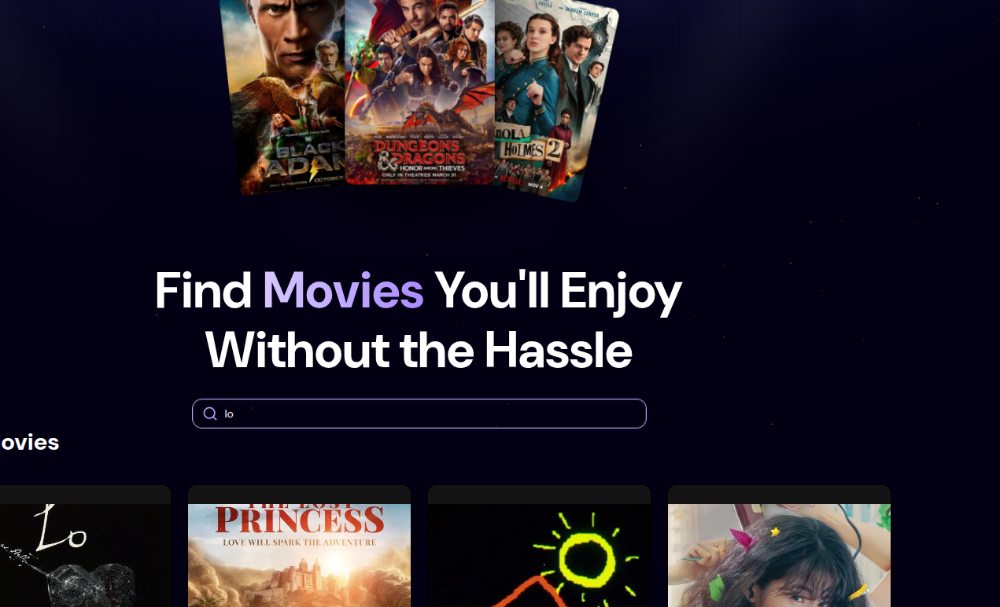

## 🎬 MovieFinder – Discover Movies You’ll Love

A sleek, Netflix-inspired web app for discovering trending and popular movies.
Built with **React 19 + Vite 7**, powered by the **TMDB API**, and enhanced with **Appwrite** for analytics and trending data.



---

### ✨ Features

- 🔍 **Instant Movie Search** – Find movies in real-time with TMDB API.
- 🔥 **Trending Section** – Displays top searched movies from Appwrite database.
- 🎞️ **Netflix-style Cards** – Smooth hover animations and star ratings.
- ⚡ **Skeleton + Fade Loading** – Optimized UX: skeleton grid for initial load, spinner for searches.
- 💾 **Appwrite Integration** – Tracks popular searches and movie stats.
- 🌙 **Dark Modern UI** – Tailwind 3 + DM Sans + Bebas Neue for that cinematic feel.

---

### 🛠️ Tech Stack

| Category  | Tools                                                                                           |
| --------- | ----------------------------------------------------------------------------------------------- |
| Framework | [React 19](https://react.dev/), [Vite 7](https://vitejs.dev/)                                   |
| Styling   | [TailwindCSS 4](https://tailwindcss.com/), [Lucide Icons](https://lucide.dev/icons), [Shadcn]() |

| Backend | [Appwrite v1.8+](https://appwrite.io/) (Database + trending analytics) |
| Data Source | [TMDB API](https://developer.themoviedb.org/) |
| Utilities | `react-use`, `clsx`, `class-variance-authority`, `sonner` |

---

### ⚙️ Installation

1. **Clone the repository**

   ```bash
   git clone https://github.com/yourusername/movie-finder.git
   cd movie-finder
   ```

2. **Install dependencies**

   ```bash
   npm install
   ```

3. **Set up environment variables**

   Create a `.env` file or update `src/lib/env.ts` with your keys:

   ```ts
   export const environmentVariables = {
     PROJECT_ID: "your_appwrite_project_id",
     DATABASE_ID: "your_database_id",
     TABLE_ID: "your_table_id",
     VITE_TMDB_API_KEY: "your_tmdb_api_key",
     API_BASE_URL: "https://api.themoviedb.org/3",
   };
   ```

4. **Run locally**

   ```bash
   npm run dev
   ```

   Your app will be live at **[http://localhost:5173](http://localhost:5173)**

---

### 📦 Appwrite Setup

1. Create a new Appwrite project.
2. Add a **Database** and a **Table** (previously Collection) with fields:

   - `searchTerm` (string)
   - `count` (integer)
   - `movie_id` (string)
   - `poster_url` (string)
   - `title` (string)
   - `vote_average`, `release_date`, `original_language`

3. Generate an **API Key** and plug your IDs into `env.ts`.

---

### 💡 Scripts

| Command          | Description            |
| ---------------- | ---------------------- |
| `pnpm run dev`   | Run development server |
| `pnpm run build` | Build for production   |

---

### 🧠 Folder Structure

```
src/
 ├─ components/
 │   ├─ movie-card.tsx
 │   ├─ search.tsx
 │   ├─ spinner.tsx
 │   ├─ movie-skeleton.tsx
 │   └─ ui/
 ├─ lib/
 │   ├─ appwrite.ts
 │   ├─ env.ts
 │   ├─ types.ts
 ├─ App.tsx
 ├─ main.tsx
 └─ styles.css
```

---

### 🌐 Deployment

You can deploy easily on:

- **Vercel**
- **Netlify**
- **Appwrite Cloud Hosting**

Make sure to set the same environment variables in your hosting platform.

---

### 📸 UI Previews

| Loading State                             | Search Results                          |
| ----------------------------------------- | --------------------------------------- |
|  |  |

---

### 🙌 Credits

- [TMDB](https://www.themoviedb.org/) for movie data.
- [Appwrite](https://appwrite.io/) for backend services.
- Inspired by _., <a href="https://www.youtube.com/@javascriptmastery/videos" target="_blank"><b>JavaScript Mastery</b></a>,._

---

### 🧾 License

Feel free to modify and use this template in your own projects.

---

Would you like me to include **copy-paste badges** (e.g. React + Tailwind + Appwrite) and a **short project banner** at the top for GitHub presentation?
